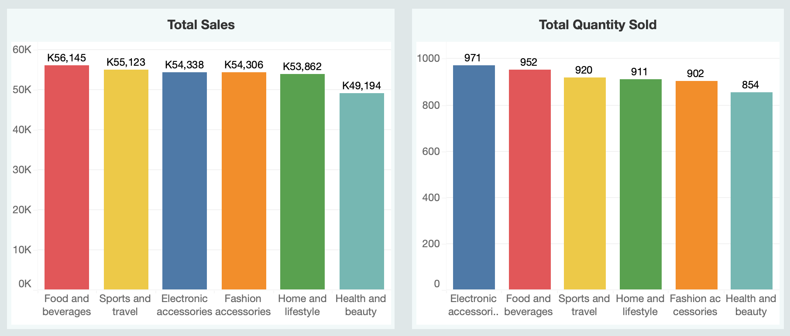
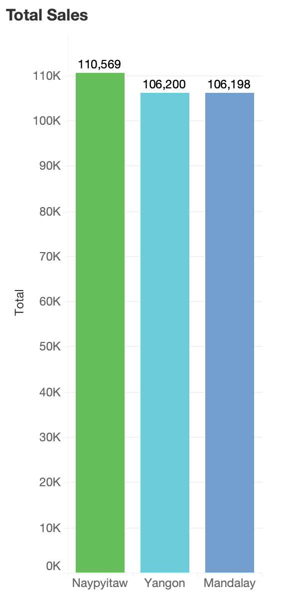
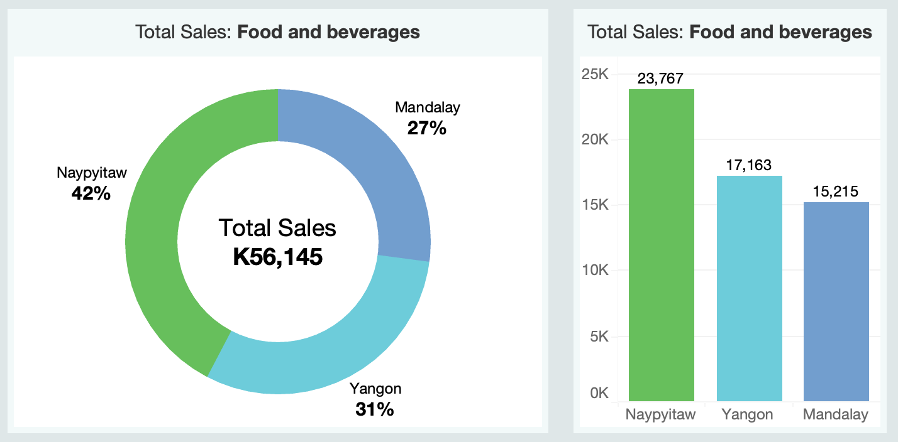
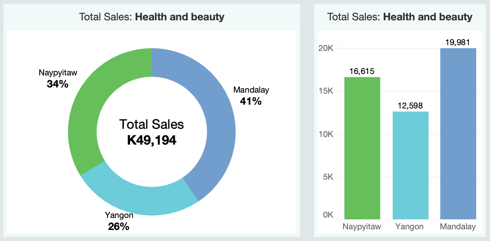
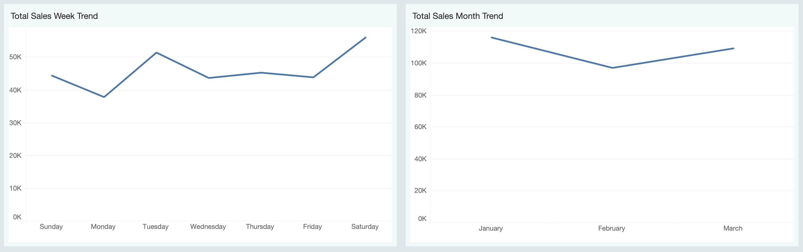
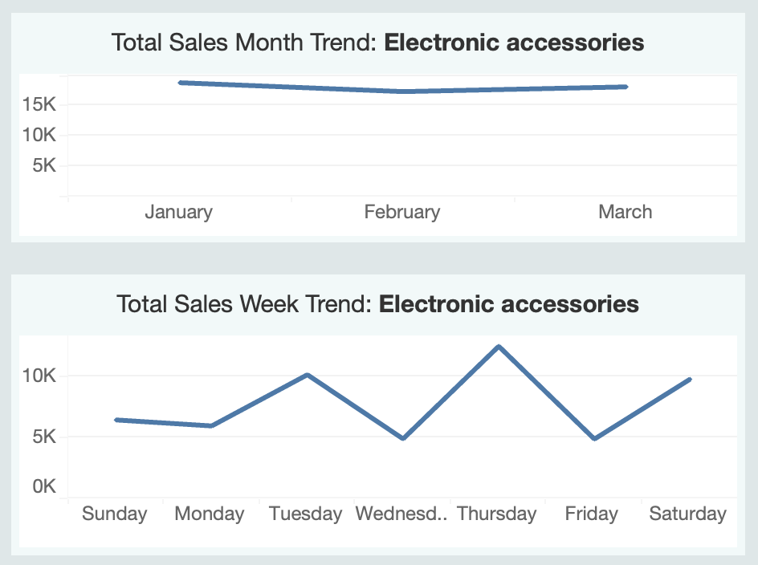

# 👋🏼 Introduction

This project I worked on analyzes the sales performance of product lines in a supermarket, treating each product line as a distinct marketing campaign. By leveraging SQL for data analysis and Tableau for visualization, the project provides actionable insights into revenue trends and regional performance. The resulting dashboard I created highlights key metrics and trends to inform data-driven marketing decisions. **The dashboard can be viewed [here](https://public.tableau.com/views/SupermarketProductLinePerformance/SupermarketProductLinePerformance?:language=en-US&publish=yes&:sid=&:redirect=auth&:display_count=n&:origin=viz_share_link).**

The dataset I used was sourced on Kaggle and can be found [here](https://www.kaggle.com/datasets/aungpyaeap/supermarket-sales).

# 🗂️ Background

The dataset contains transactional records from a supermarket, including details such as product lines, sales revenue, branch, city, and customer demographics. SQL was used to calculate key sales metrics, such as total revenue per product line and region. Tableau was then utilized to design an interactive dashboard, enabling users to explore sales trends and uncover actionable insights.

### ⚠️ Dataset Disclaimer
Upon analyzing the dataset for cleaning, I noticed some miscalculations in the dataset which made gross income and gross margin percentage inaccurate. Looking at the comments on Kaggle further validated that these columns were inaccurate and not useful to the dataset. Because of this, I focused mainly on total revenue and quantity for my analysis.

# 🧰 Tools I Used

For this project, I used these key tools:

- SQL: This allowed me to query the database and retrieve the essential data I needed to gain insights.
- PostgreSQL: This was the most ideal database management system for me to use.
- Visual Studio Code: This made executing SQL queries more convenient and efficient.
- Tableau: This allowed me to create simple yet effective visuals that captured the results of my code. This is also what I used to create the final dashboard that displayed the results of my analysis.
- Git & Github: These allowed me to share my SQL scripts and analysis, and made sure versions were kept up to date.

# 📉 The Analysis

### 1. Which product lines generate the most revenue?

The first and most instinctual thing for me to do to analyze performance was to look at total revenue per product line. I also wanted to look at total quantity sold to see how this affected revenue.

```sql
SELECT 
    Product_Line, 
    SUM(Total) AS Total_Revenue, 
    SUM(Quantity) AS Total_Quantity
FROM supermarket_sales
GROUP BY Product_Line
ORDER BY Total_Revenue DESC; 
```

I visualized my results in bar charts using Tableau:


I noticed that while electronic accessories had the highest quantity sold, it still ranked third in revenue.

### 2. Which city/branch is top performing or underperforming?

Next I wanted to look at the performance of each city: first as a whole, and then filtered by product line. I wanted to look at the differences in performance of product lines per city.

```sql
--City Performance--
SELECT 
    City,
    SUM(Total) AS Total_Revenue
FROM supermarket_sales
GROUP BY City
ORDER BY Total_Revenue DESC;

--City Performance by Product Line--
SELECT 
    city, 
    Product_Line, 
    SUM(Total) AS Total_Revenue, 
    SUM(Quantity) AS Total_Quantity
FROM supermarket_sales
GROUP BY City, Product_Line
ORDER BY City, Total_Revenue DESC;
```

When looking at total revenue across all cities, Naypyitaw took the lead, while Yangon and Mandalay performed similarly.


To visualize product line performance per city, I used a donut chart and a bar chart filtered by product line. Earlier, I saw that food and beverages had the highest sales. So let's look at its performance per city:

It turns out that 42% of food and beverage sales also came from the top performing city, Naypyitaw.
I also discovered earlier that health and beauty had the lowest sales. So let's take a look at how it performed per city:

Mandalay clearly outperformed the other two cities in health and beauty sales. More marketing efforts focused on health and beauty products would help boost sales in Naypyitaw and Yangon.

### 3. Are there seasonal or weekly trends in revenue?

To get a better understanding of the performance of each product line, I wanted to check if there were any trends within the week. Did certain days peak more in sales compared to others?

```sql
--Revenue by Day of the Week--
SELECT 
    to_char(Sale_Date, 'Day') AS Day_Of_Week, 
    SUM(Total) AS Total_Revenue
FROM supermarket_sales
GROUP BY Day_Of_Week;

--Revenue by Day of the Week and Product Line--
SELECT 
    product_line,
    to_char(Sale_Date, 'Day') AS Day_Of_Week, 
    SUM(Total) AS Total_Revenue
FROM supermarket_sales
GROUP BY product_line, Day_Of_Week
ORDER BY product_line, Total_Revenue DESC;
```

I also wanted to check if there were any seasonal trends. However, the data available was only for Q1 so I could only get a limited understanding of how sales trend throughout the year.

```sql
--Revenue by Month--
SELECT 
    to_char(Sale_Date, 'Month') AS Month, 
    SUM(Total) AS Total_Revenue
FROM supermarket_sales
GROUP BY Month;


--Revenue by Month and Product Line--
SELECT 
    product_line,
    to_char(Sale_Date, 'Month') AS Month, 
    SUM(Total) AS Total_Revenue
FROM supermarket_sales
GROUP BY product_line, Month 
ORDER BY product_line, Total_Revenue DESC;
```

Looking at the week trend, I found that sales were generally highest on Tuesdays and Saturdays. During Q1, total sales peaked in January and had a low dip in February.


I also filtered it per product line to visualize the trends for different product categories. Let's look at electronic accessories:

For Q1, this product line didn't show any relevant peaks or dips. Throughout the week, it has its highest performance on Tuesdays and Thursdays. This showed me that each product line differs in its peak seasons. Marketing campaigns could be done to boost sales during off seasons.

# 💡 Key Findings
**1. Revenue Distribution vs. Quantity Sold**
- Revenue appears to be quite evenly distributed across product lines; however, Health and Beauty appears to generate the lowest revenue among all six categories.
- Although Health and Beauty had the lowest revenue, it still had significant quantities sold (854 units). This is an indication of lower average prices.

**2. Week Trend Varies Across Product Lines**
- Overall, sales peak highest on Tuesdays and Saturdays, but this varies across product lines. For example, Home and Lifestyle has its peak revenue on Sundays, indicating strong weekend demand.
- As for underperforming days, this too varies. Food and Beverages and Electronic Accessories see the lowest revenue on Fridays. Health and Beauty struggles most on Sundays.

**3. Month Trend Varies Across Product Lines**
- Overall, sales peaked in January and dipped in February. However, this changes per category. Food and Beverages, which is the highest performing product line, actually generated the highest revenue in February.
- Home and Lifestyle and Health and Beauty revenue is significantly lower in February.

**4. Naypyitaw As Top Performing City**
- Naypyitaw generated the highest total revenue overall, which was driven primarily by Food and Beverages and Fashion Accessories, which contributed the most revenue in this city.

**5. Yangon and Mandalay Performance Varies**
- Yangon’s Home and Lifestyle product line generated the highest revenue for a single product line across all cities. This indicates a high demand for these products in Yangon and shows the city’s market potential for this category.
- Mandalay has a more balanced revenue distribution across product lines. However, it showed that Health and Beauty was one of its top performing categories, despite this product line generating the lowest revenue overall.

# 📋 Recommendations
### Based on my analysis and key findings, these are the actionable insights I have for marketing strategy.

**1. Improvements on the Health and Beauty Product Line**
- As the Health and Beauty line generated the lowest revenue, targeted marketing campaigns should be done to boost sales in this category. Campaigns like promotional offers or bundling with other high-performing categories could increase visibility and sales.
- The pricing strategy for this category should be evaluated, given that quantity sold was not too low. Premium or higher-margin products could help increase overall revenue.

**2. Marketing Campaigns for Specific Days of the Week and Months/Seasons**
- To capitalize on existing demand, marketing campaigns such as special discounts or offers could be done on peak performance days to maximize customer spending.
- Targeted marketing campaigns should be developed to boost sales during underperforming days.
- Seasonal campaigns could help boost sales during important event dates and seasons such as New Year, Valentine's Day, and spring season.

**3. Targeted Campaigns per City**
- With Naypyitaw generating the highest revenue overall, investing in promotions for its top-performing categories would help capitalize on strong sales performance. Introducing loyalty programs could also help retain and grow the customer base.
- Yangon showed strong potential in the Home and Lifestyle category. To sustain the strong performance, expanding the variety of products in this category could help meet high demand and increase revenue.
- In Mandalay, multi-category promotions would help boost sales given the diverse preferences. Resources should also be allocated to grow categories with high potential, such as Health and Beauty.

# ✅ Conclusions

My analysis provided a comprehensive overview of sales performance in Q1 across cities and product lines, uncovering key trends and actionable insights. My findings emphasized the importance of considering varying preferences across cities and the different performance of each product line, as these factors significantly influence overall revenue. Tailoring strategies to align with city-specific demands and product trends is essential for meeting customer needs and maximizing sales potential. Overall, this project underscored how leveraging data-driven insights can optimize performance and drive sustainable revenue growth.

## 📝 Closing Thoughts

Using a sample dataset for this project proved to be quite limiting, as the data provided was faulty. Because of these limitations, I was not able to deepen the quality of my analysis and findings. 👩🏻‍💻 This highlighted the importance of clean, accurate, and reliable data in performing data analysis. However, I was still able to extract some essential information from the dataset and make use of it to uncover important insights. 👍🏻 In the end, what you do with the data given the tools you have is what ultimately brings meaning and usefulness to a project.